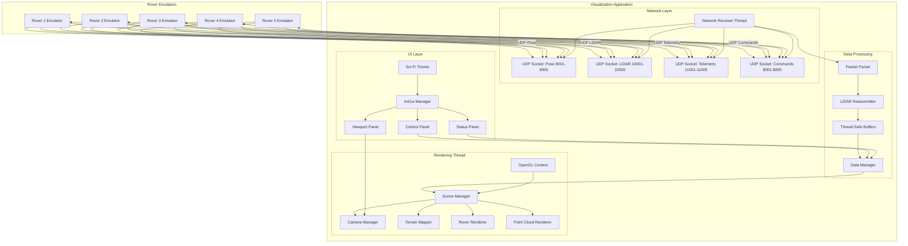
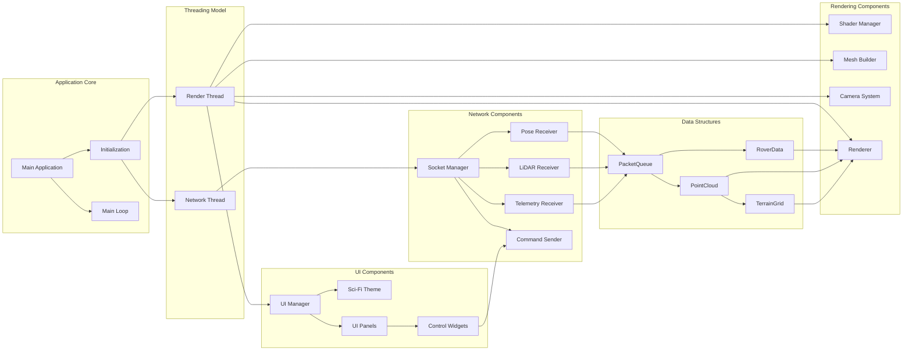
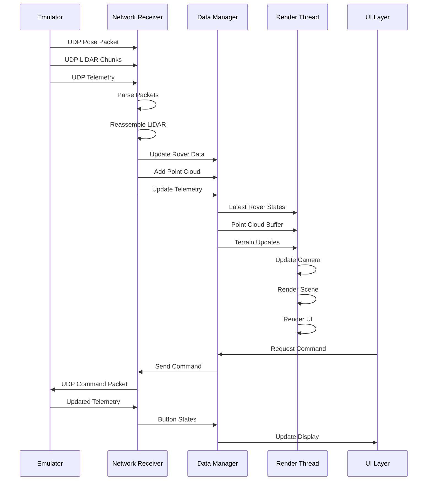
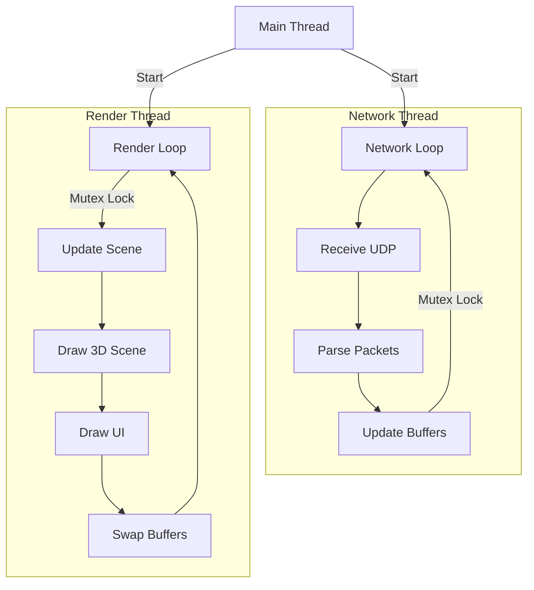

# Terrafirma Rovers - System Architecture

## Overview

This document describes the architecture of the real-time 3D visualization and control system for autonomous rovers. The system receives UDP data streams from 5 rovers, visualizes them in a 3D environment, and provides a sci-fi styled control interface.

## Design Decisions

| Decision | Choice | Notes |
|----------|--------|-------|
| **Platform** | macOS first | Linux compatibility later |
| **Rover Models** | Simple geometric shapes | Different colors per rover; models added later |
| **Point Cloud Colors** | Height gradient | Low to high elevation coloring |
| **Terrain Rendering** | Toggleable wireframe/solid | Both support height-based coloring |
| **Point History** | Keep all points | No limit on point cloud history |
| **Offline Rovers** | Show at last position | Keep point cloud visible |
| **Window Size** | 1280x720 default | Resizable, fullscreen toggle |
| **Camera Controls** | WASD + mouse | 1-5 keys for rover selection |
| **Units Display** | Show units in UI | Scale-independent (fixed screen size) |
| **Coordinate Units** | Meters | As per emulator data |

## System Architecture Diagram



## Component Architecture



## Data Flow



## Threading Model



## Module Structure

### 1. Network Module (`network/`)
- **UDPReceiver**: Manages UDP sockets for all rovers
- **PacketParser**: Parses binary UDP packets
- **LiDARReassembler**: Reassembles chunked LiDAR packets
- **CommandSender**: Sends button commands to rovers

### 2. Data Module (`data/`)
- **RoverData**: Stores pose, orientation, button states per rover
- **PointCloud**: Manages LiDAR point collections
- **TerrainGrid**: Grid-based terrain height map
- **DataManager**: Thread-safe data access and updates

### 3. Rendering Module (`render/`)
- **Renderer**: Main OpenGL rendering context
- **ShaderManager**: Shader compilation and management
- **Camera**: Camera system (free-fly, follow rover)
- **RoverRenderer**: Renders rover models
- **PointCloudRenderer**: Efficient point cloud rendering
- **TerrainRenderer**: Terrain mesh rendering

### 4. UI Module (`ui/`)
- **UIManager**: ImGui setup and management
- **SciFiTheme**: Custom sci-fi styling
- **ControlPanel**: Rover selection and control
- **StatusPanel**: Rover status display
- **ViewportPanel**: 3D viewport with controls

### 5. Core Module (`core/`)
- **Application**: Main application class
- **Timer**: Performance timing
- **Config**: Configuration management
- **Math**: Math utilities (using GLM)

## Sci-Fi UI Design Elements

### Visual Style
- **Color Scheme**: 
  - Primary: Cyan/Blue (#00FFFF, #00D4FF)
  - Secondary: Dark Blue/Black (#001122, #002244)
  - Accent: Orange/Amber (#FF8800, #FFAA00)
  - Background: Deep space black (#000011)
  - Text: Bright cyan/white (#CCFFFF)

### UI Components
- **Holographic panels**: Semi-transparent with glow effects
- **Scan lines**: Subtle animated scan line effects
- **Grid overlays**: Hexagonal or grid patterns
- **Glowing borders**: Neon-style borders on panels
- **Animated indicators**: Pulsing/breathing effects for active states
- **Terminal-style fonts**: Monospace fonts for data displays
- **Progress bars**: Animated sci-fi style progress indicators

### Layout
- **Left Panel**: Rover list and selection (holographic list)
- **Right Panel**: Selected rover status and controls (command center style)
- **Bottom Panel**: System status and metrics (HUD style)
- **3D Viewport**: Full-screen with overlay controls (minimal UI in viewport)

## Performance Considerations

### Optimization Strategies
1. **Point Cloud Rendering**: Use instanced rendering, VBOs for efficiency
2. **Terrain Updates**: Incremental mesh updates, only rebuild changed regions
3. **Threading**: Lock-free queues where possible, minimize mutex contention
4. **Memory Management**: Keep all points (no history limit), optimize storage
5. **Rendering**: Frustum culling, LOD for distant objects
6. **UI Rendering**: Batch ImGui draw calls, minimize UI updates

### Point Cloud Strategy
- Keep all LiDAR points (no pruning)
- Color by height gradient (low=blue, high=red)
- Efficient VBO management for growing point count
- Consider spatial data structures if needed

### Latency Targets
- Network receive: < 5ms
- Data processing: < 10ms
- Rendering: < 30ms
- Total: < 50ms end-to-end

## Dependencies

### Required Libraries
- **GLFW3**: Window and OpenGL context management
- **GLAD/GL3W**: OpenGL function loader
- **GLM**: Mathematics library
- **Dear ImGui**: Immediate-mode GUI
- **Standard C++17**: Threading, networking, etc.

### Build System
- **CMake**: Cross-platform build system
- **Compiler**: Clang (macOS) initially, GCC for Linux later
- **Target**: macOS first, Linux (Ubuntu 22.04) compatibility later

### Platform Notes
- Development on macOS with cross-platform code
- Use POSIX sockets (compatible with both platforms)
- OpenGL 3.3 Core Profile (works on both platforms)
- Test Linux compatibility before final delivery

## File Structure

```
visualization/
├── CMakeLists.txt
├── src/
│   ├── main.cpp
│   ├── core/
│   │   ├── Application.h/cpp
│   │   ├── Timer.h/cpp
│   │   └── Config.h/cpp
│   ├── network/
│   │   ├── UDPReceiver.h/cpp
│   │   ├── PacketParser.h/cpp
│   │   ├── LiDARReassembler.h/cpp
│   │   └── CommandSender.h/cpp
│   ├── data/
│   │   ├── RoverData.h/cpp
│   │   ├── PointCloud.h/cpp
│   │   ├── TerrainGrid.h/cpp
│   │   └── DataManager.h/cpp
│   ├── render/
│   │   ├── Renderer.h/cpp
│   │   ├── ShaderManager.h/cpp
│   │   ├── Camera.h/cpp
│   │   ├── RoverRenderer.h/cpp
│   │   ├── PointCloudRenderer.h/cpp
│   │   ├── TerrainRenderer.h/cpp
│   │   └── shaders/
│   │       ├── basic.vert
│   │       ├── basic.frag
│   │       ├── pointcloud.vert
│   │       ├── pointcloud.frag
│   │       └── terrain.vert/frag
│   └── ui/
│       ├── UIManager.h/cpp
│       ├── SciFiTheme.h/cpp
│       ├── ControlPanel.h/cpp
│       ├── StatusPanel.h/cpp
│       └── ViewportPanel.h/cpp
├── include/
│   └── common.h
└── README.md
```

